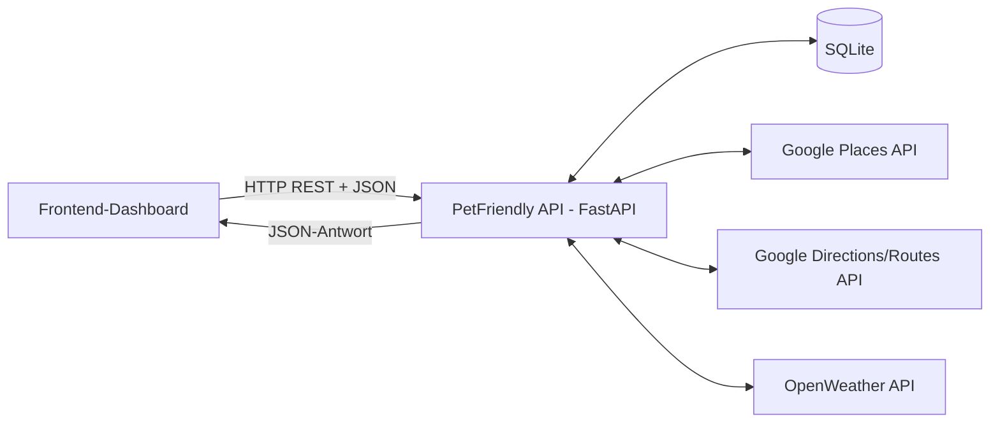
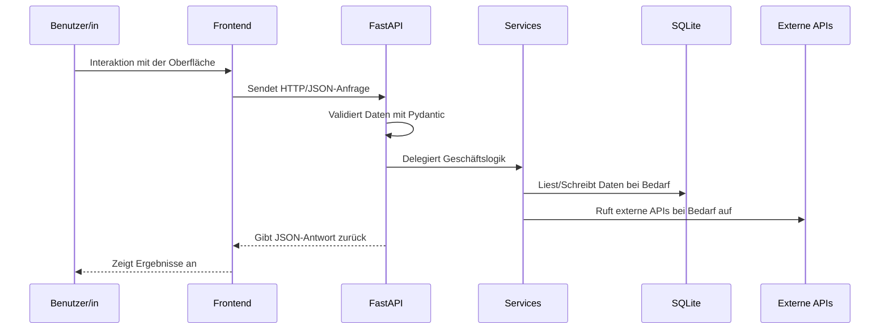
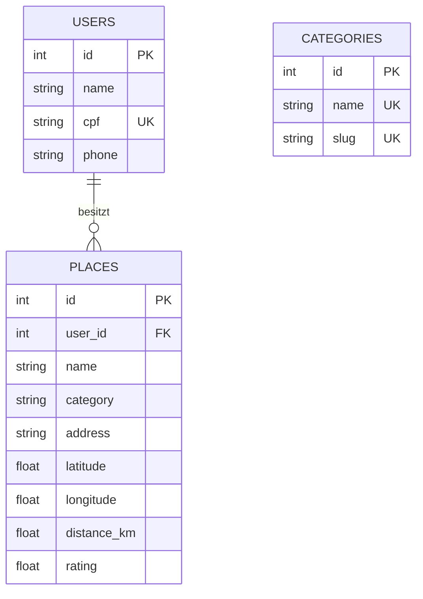

# PetFriendly API

**Sprachen:**  
[English](README.md) | [Português](README.pt-BR.md) | [Deutsch](README.de.md)

Die **PetFriendly API** ist ein RESTful Backend-Service, der mit **FastAPI** entwickelt wurde. Die API unterstützt eine Webanwendung zur Suche nach pet-friendly Orten und stellt Endpunkte für Ortssuche, Routenberechnung, Wetterinformationen, Kategorien, einen einfachen Login-Prozess und die Verwaltung von Favoriten bereit.

Dieses Repository ist Teil des **PetFriendly MVP**, eines Full-Stack-Projekts, das aus einer Backend-API und einem Frontend-Dashboard besteht.

## Zugehöriges Repository

- Frontend-Dashboard: https://github.com/Elainecbr/petfriendly-dashboard

## Überblick

Ziel dieser API ist es, ein Web-Dashboard zu unterstützen, mit dem Benutzerinnen und Benutzer pet-friendly Orte wie Parks, Plätze und Einrichtungen suchen, Routeninformationen anzeigen, aktuelle Wetterdaten abrufen und bevorzugte Orte speichern können.

Das Projekt zeigt eine modulare Backend-Architektur mit **FastAPI**, **SQLAlchemy**, **Pydantic**, **SQLite** und **Docker** sowie Integrationen mit externen Diensten wie **Google Places**, **Google Directions/Routes** und **OpenWeather**.

## Hauptfunktionen

- Suche nach pet-friendly Orten mit Google Places
- Berechnung von Routen und Entfernungen mit Google Directions/Routes
- Abruf aktueller Wetterinformationen mit OpenWeather
- Auflistung vordefinierter Ortskategorien
- Erstellung oder Aktualisierung von Benutzerinnen und Benutzern über einen Easy-Login-Endpunkt
- Speichern, Auflisten und Verwalten von Lieblingsorten pro Benutzerin oder Benutzer
- Lokale Datenpersistenz mit SQLite
- Automatische API-Dokumentation mit OpenAPI/Swagger
- Lokale Ausführung mit Docker oder einer Python Virtual Environment

## Verwendete Technologien

| Technologie | Zweck |
|---|---|
| Python | Hauptprogrammiersprache |
| FastAPI | Framework für die REST API |
| Uvicorn | ASGI-Server |
| SQLAlchemy | ORM und Datenbankzugriff |
| SQLite | Lokale Datenbank |
| Pydantic | Datenvalidierung und Schemas |
| Requests | HTTP-Client für externe APIs |
| python-dotenv | Verwaltung von Umgebungsvariablen |
| Docker | Containerisierte Ausführung |
| Docker Compose | Lokale Orchestrierung |
| OpenAPI / Swagger | Interaktive API-Dokumentation |

## Projektstruktur

```text
petfriendly-api/
├── app/
│   ├── config/
│   │   └── settings.py              # Laden von Umgebungsvariablen
│   ├── database/
│   │   ├── database.py              # SQLAlchemy- und SessionLocal-Konfiguration
│   │   └── seed.py                  # Initiales Seed-Skript für Standardkategorien
│   ├── models/
│   │   ├── category.py              # ORM-Modell für Kategorien
│   │   ├── user.py                  # ORM-Modell für Benutzerinnen und Benutzer
│   │   └── place.py                 # ORM-Modell für gespeicherte Lieblingsorte
│   ├── routes/
│   │   ├── categories.py            # Endpunkte für Kategorien
│   │   ├── users.py                 # Easy-Login-Endpunkt
│   │   ├── places.py                # Ortssuche, Routen und Favoriten
│   │   └── weather.py               # Wetter-Endpunkt
│   ├── schemas/
│   │   ├── category_schema.py       # Validierungsschemas für Kategorien
│   │   ├── user_schema.py           # Validierungsschemas für Benutzerinnen und Benutzer
│   │   └── place_schema.py          # Validierungsschemas für Lieblingsorte
│   ├── services/
│   │   └── google_places.py         # Integration mit Google Places und Directions
│   └── main.py                      # FastAPI-App, CORS, Router und Seed-Setup
├── Dockerfile
├── docker-compose.yml
├── requirements.txt
├── .env.example
├── .gitignore
└── README.md
```

## Architektur

Das Projekt folgt einer **Client-Server-Architektur**:

- Das **Frontend-Dashboard** sendet HTTP-Anfragen an die API.
- Das **FastAPI-Backend** stellt REST-Endpunkte bereit und gibt JSON-Antworten zurück.
- **Pydantic-Schemas** validieren Eingabe- und Ausgabedaten.
- **SQLAlchemy-Modelle** bilden Python-Objekte auf Datenbanktabellen ab.
- **SQLite** speichert Benutzerinnen und Benutzer, Kategorien und Lieblingsorte.
- Externe Dienste liefern Ortssuche, Routenberechnung und Wetterdaten.



## Ausführungsfluss

1. Die Benutzerin oder der Benutzer interagiert mit dem Frontend-Dashboard.
2. Das Frontend sendet eine HTTP-Anfrage an das FastAPI-Backend.
3. Die API validiert die Anfrage mit Pydantic.
4. Der Route Handler delegiert die Geschäftslogik an die Service-Schicht.
5. Die API liest aus SQLite oder schreibt Daten in SQLite, wenn dies erforderlich ist.
6. Die API kann externe Dienste wie Google Places, Google Directions/Routes oder OpenWeather aufrufen.
7. Die API gibt eine JSON-Antwort an das Frontend zurück.
8. Das Frontend stellt die Ergebnisse für die Benutzerin oder den Benutzer dar.



## Datenbankmodell



## Externe APIs

Dieses Projekt integriert die folgenden externen Dienste:

- **Google Places API**: Suche nach pet-friendly Orten.
- **Google Directions/Routes API**: Berechnung von Routen, Entfernungen und Informationen zum Fortbewegungsmodus.
- **OpenWeather API**: Abruf von Wetterdaten wie Temperatur, Regenwahrscheinlichkeit und Luftfeuchtigkeit.

## Voraussetzungen

- Python 3.11+
- Git
- Docker und Docker Compose, optional, aber empfohlen
- Google API Key mit aktivierten Places- und Directions/Routes-Diensten
- OpenWeather API Key

## Umgebungsvariablen

Erstelle im Stammverzeichnis des Projekts eine `.env`-Datei und verwende `.env.example` als Vorlage:

```env
GOOGLE_API_KEY=your_google_api_key_here
OPENWEATHER_API_KEY=your_openweather_api_key_here
```

## Ausführung mit Docker

Repository klonen:

```bash
git clone https://github.com/Elainecbr/petfriendly-api.git
cd petfriendly-api
```

`.env`-Datei erstellen:

```bash
cp .env.example .env
```

API-Schlüssel eintragen und anschließend ausführen:

```bash
docker compose up --build
```

API-Dokumentation öffnen:

```text
http://127.0.0.1:8000/docs
```

Container stoppen:

```bash
docker compose down
```

## Ausführung ohne Docker

Repository klonen:

```bash
git clone https://github.com/Elainecbr/petfriendly-api.git
cd petfriendly-api
```

Virtuelle Umgebung erstellen und aktivieren:

```bash
python3 -m venv .venv
source .venv/bin/activate
```

Unter Windows:

```bash
.venv\Scripts\activate
```

Abhängigkeiten installieren:

```bash
pip install --upgrade pip
pip install -r requirements.txt
```

`.env`-Datei erstellen und die erforderlichen API-Schlüssel eintragen.

API starten:

```bash
uvicorn app.main:app --reload --host 127.0.0.1 --port 8000
```

Öffnen:

```text
http://127.0.0.1:8000/docs
```

## Wichtigste Endpunkte

### Health Check

```bash
curl http://127.0.0.1:8000/health
```

Erwartete Antwort:

```json
{"status": "ok"}
```

### Kategorien auflisten

```bash
curl http://127.0.0.1:8000/categories/
```

### Pet-friendly Orte suchen

```bash
curl "http://127.0.0.1:8000/places/search?location=Copacabana&keyword=pet+friendly&radius=3000"
```

### Route berechnen

```bash
curl "http://127.0.0.1:8000/places/route?origin=Copacabana&destination=Dog's+Beach+Club&mode=walking"
```

### Easy Login

```bash
curl -X POST "http://127.0.0.1:8000/users/easy-login" \
  -H "Content-Type: application/json" \
  -d '{
    "name": "User Name",
    "cpf": "123.456.789-00",
    "phone": "(21) 99999-9999"
  }'
```

### Lieblingsort speichern

```bash
curl -X POST "http://127.0.0.1:8000/places/favorites?user_id=1" \
  -H "Content-Type: application/json" \
  -d '{
    "name": "Dogs Beach Club",
    "category": "park",
    "address": "Rio de Janeiro, Brazil",
    "latitude": -23.0,
    "longitude": -43.5,
    "rating": 4.9
  }'
```

### Favoriten einer Benutzerin oder eines Benutzers auflisten

```bash
curl "http://127.0.0.1:8000/places/favorites?user_id=1"
```

### Wetter

```bash
curl "http://127.0.0.1:8000/weather/?city=Rio de Janeiro"
```

## API-Dokumentation

FastAPI erzeugt automatisch eine interaktive Dokumentation:

- Swagger UI: `http://127.0.0.1:8000/docs`
- ReDoc: `http://127.0.0.1:8000/redoc`

Über Swagger UI können alle Endpunkte geprüft, Request- und Response-Schemas angesehen und die API direkt im Browser getestet werden.

## Datenbank

Die SQLite-Datenbankdatei wird automatisch erstellt, wenn die API gestartet wird.

Lokale Datenbank zurücksetzen:

```bash
rm petfriendly.db
```

Beim nächsten Start werden die Tabellen und Standardkategorien erneut erstellt.

## Lernziele

Dieses Projekt wurde entwickelt, um die folgenden Themen praktisch umzusetzen und zu vertiefen:

- Entwicklung einer REST API mit FastAPI
- Modularisierung eines Backends mit Routes, Models, Schemas und Services
- Datenbankmodellierung mit SQLAlchemy
- Datenvalidierung mit Pydantic
- Integration externer APIs
- Verwaltung von Umgebungsvariablen
- Lokale Ausführung mit Docker
- API-Dokumentation mit OpenAPI/Swagger
- Client-Server-Kommunikation über HTTP und JSON

## Mögliche Weiterentwicklungen

Mögliche Verbesserungen für zukünftige Versionen:

- Authentifizierung mit JWT hinzufügen
- SQLite durch PostgreSQL für ein produktionsnäheres Deployment ersetzen
- Automatisierte Tests mit pytest ergänzen
- Fehlerbehandlung bei Ausfällen externer APIs verbessern
- Paginierung und Filterung für Favoriten hinzufügen
- Backend bei einem Cloud-Anbieter deployen
- CI/CD mit GitHub Actions einrichten

## Autorin

Entwickelt von **Elaine C. Bundscherer**.

- GitHub: https://github.com/Elainecbr
- Portfolio: https://elaine-online.de/

