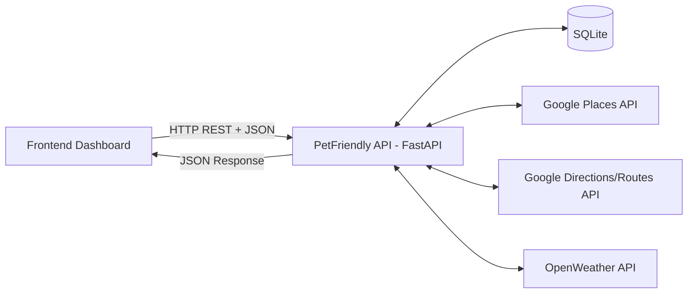
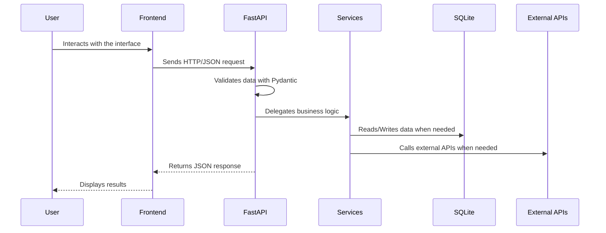
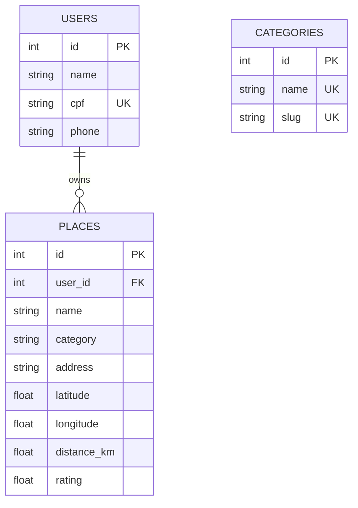

# PetFriendly API

PetFriendly API is a RESTful backend service built with **FastAPI** for a pet-friendly web application. It provides endpoints for searching pet-friendly places, calculating routes, retrieving weather information, managing categories, handling a simple user login flow, and storing users’ favorite places.

This repository is part of the **PetFriendly MVP**, a full stack project composed of a backend API and a frontend dashboard.

## Related Repository

- Frontend Dashboard: https://github.com/Elainecbr/petfriendly-dashboard

## Overview

The goal of this API is to support a web dashboard where users can search for pet-friendly locations such as parks, squares and establishments, view route information, check current weather data, and save favorite places.

The project demonstrates a modular backend architecture using FastAPI, SQLAlchemy, Pydantic, SQLite and Docker, with integrations to external services such as Google Places, Google Directions/Routes and OpenWeather.

## Main Features

- Search for pet-friendly places using Google Places
- Calculate routes and distances using Google Directions/Routes
- Retrieve real-time weather information using OpenWeather
- List predefined place categories
- Create or update users through an Easy Login endpoint
- Save, list and manage favorite places by user
- Persist data locally using SQLite
- Document the API automatically with OpenAPI/Swagger
- Run the application locally with Docker or a Python virtual environment

## Technologies Used

| Technology | Purpose |
|---|---|
| Python | Main programming language |
| FastAPI | REST API framework |
| Uvicorn | ASGI server |
| SQLAlchemy | ORM and database access |
| SQLite | Local database |
| Pydantic | Data validation and schemas |
| Requests | HTTP client for external APIs |
| python-dotenv | Environment variable management |
| Docker | Containerized execution |
| Docker Compose | Local orchestration |
| OpenAPI / Swagger | Interactive API documentation |

## Project Structure

```text
petfriendly-api/
├── app/
│   ├── config/
│   │   └── settings.py              # Environment variable loading
│   ├── database/
│   │   ├── database.py              # SQLAlchemy and SessionLocal configuration
│   │   └── seed.py                  # Initial seed for default categories
│   ├── models/
│   │   ├── category.py              # Category ORM model
│   │   ├── user.py                  # User ORM model
│   │   └── place.py                 # Favorite place ORM model
│   ├── routes/
│   │   ├── categories.py            # Category endpoints
│   │   ├── users.py                 # Easy Login endpoint
│   │   ├── places.py                # Place search, routes and favorites
│   │   └── weather.py               # Weather endpoint
│   ├── schemas/
│   │   ├── category_schema.py       # Category validation schemas
│   │   ├── user_schema.py           # User validation schemas
│   │   └── place_schema.py          # Favorite place validation schemas
│   ├── services/
│   │   └── google_places.py         # Google Places and Directions integration
│   └── main.py                      # FastAPI app, CORS, routers and seed setup
├── Dockerfile
├── docker-compose.yml
├── requirements.txt
├── .env.example
├── .gitignore
└── README.md
```

## Architecture

The project follows a **client-server architecture**:

- The **frontend dashboard** sends HTTP requests to the API.
- The **FastAPI backend** exposes REST endpoints and returns JSON responses.
- **Pydantic schemas** validate input and output data.
- **SQLAlchemy models** map Python objects to database tables.
- **SQLite** stores users, categories and favorite places.
- External services provide place search, route calculation and weather data.



## Execution Flow

1. The user interacts with the frontend dashboard.
2. The frontend sends an HTTP request to the FastAPI backend.
3. The API validates the request data with Pydantic.
4. The route handler delegates business logic to the service layer.
5. The API reads from or writes to SQLite when needed.
6. The API may call external services such as Google Places, Google Directions/Routes or OpenWeather.
7. The API returns a JSON response to the frontend.
8. The frontend renders the results for the user.



## Database Model



## External APIs

This project integrates with the following external services:

- **Google Places API**: searches for pet-friendly places.
- **Google Directions/Routes API**: calculates routes, distance and travel mode information.
- **OpenWeather API**: retrieves weather data such as temperature, rain and humidity.

## Requirements

- Python 3.11+
- Git
- Docker and Docker Compose, optional but recommended
- Google API key with Places and Directions/Routes enabled
- OpenWeather API key

## Environment Variables

Create a `.env` file in the project root using `.env.example` as a reference:

```env
GOOGLE_API_KEY=your_google_api_key_here
OPENWEATHER_API_KEY=your_openweather_api_key_here
```

## Running with Docker

Clone the repository:

```bash
git clone https://github.com/Elainecbr/petfriendly-api.git
cd petfriendly-api
```

Create the `.env` file:

```bash
cp .env.example .env
```

Fill in your API keys, then run:

```bash
docker compose up --build
```

Open the API documentation:

```text
http://127.0.0.1:8000/docs
```

Stop the containers:

```bash
docker compose down
```

## Running without Docker

Clone the repository:

```bash
git clone https://github.com/Elainecbr/petfriendly-api.git
cd petfriendly-api
```

Create and activate a virtual environment:

```bash
python3 -m venv .venv
source .venv/bin/activate
```

On Windows:

```bash
.venv\Scripts\activate
```

Install the dependencies:

```bash
pip install --upgrade pip
pip install -r requirements.txt
```

Create the `.env` file and add the required API keys.

Run the API:

```bash
uvicorn app.main:app --reload --host 127.0.0.1 --port 8000
```

Open:

```text
http://127.0.0.1:8000/docs
```

## Main Endpoints

### Health Check

```bash
curl http://127.0.0.1:8000/health
```

Expected response:

```json
{"status": "ok"}
```

### List Categories

```bash
curl http://127.0.0.1:8000/categories/
```

### Search Pet-Friendly Places

```bash
curl "http://127.0.0.1:8000/places/search?location=Copacabana&keyword=pet+friendly&radius=3000"
```

### Calculate Route

```bash
curl "http://127.0.0.1:8000/places/route?origin=Copacabana&destination=Dog's+Beach+Club&mode=walking"
```

### Easy Login

```bash
curl -X POST "http://127.0.0.1:8000/users/easy-login" \
  -H "Content-Type: application/json" \
  -d '{
    "name": "User Name",
    "cpf": "123.456.789-00",
    "phone": "(21) 99999-9999"
  }'
```

### Save Favorite Place

```bash
curl -X POST "http://127.0.0.1:8000/places/favorites?user_id=1" \
  -H "Content-Type: application/json" \
  -d '{
    "name": "Dogs Beach Club",
    "category": "park",
    "address": "Rio de Janeiro, Brazil",
    "latitude": -23.0,
    "longitude": -43.5,
    "rating": 4.9
  }'
```

### List User Favorites

```bash
curl "http://127.0.0.1:8000/places/favorites?user_id=1"
```

### Weather

```bash
curl "http://127.0.0.1:8000/weather/?city=Rio de Janeiro"
```

## API Documentation

FastAPI automatically generates interactive documentation:

- Swagger UI: `http://127.0.0.1:8000/docs`
- ReDoc: `http://127.0.0.1:8000/redoc`

Through Swagger UI, it is possible to inspect all endpoints, view request and response schemas, and test the API directly in the browser.

## Database

The SQLite database file is created automatically when the API starts.

To reset the local database:

```bash
rm petfriendly.db
```

On the next startup, the tables and default categories are recreated.

## Learning Goals

This project was developed to practice and demonstrate:

- REST API development with FastAPI
- Backend modularization using routes, models, schemas and services
- Database modeling with SQLAlchemy
- Data validation with Pydantic
- Integration with external APIs
- Environment variable management
- Docker-based local execution
- API documentation with OpenAPI/Swagger
- Client-server communication using HTTP and JSON

## Future Improvements

Possible improvements for future versions:

- Add authentication with JWT
- Replace SQLite with PostgreSQL for production deployment
- Add automated tests with pytest
- Improve error handling for external API failures
- Add pagination and filtering for favorites
- Deploy the backend to a cloud provider
- Add CI/CD with GitHub Actions

## Author

Developed by **Elaine C. Bundscherer**.

- GitHub: https://github.com/Elainecbr
- Portfolio: https://elaine-online.de/

